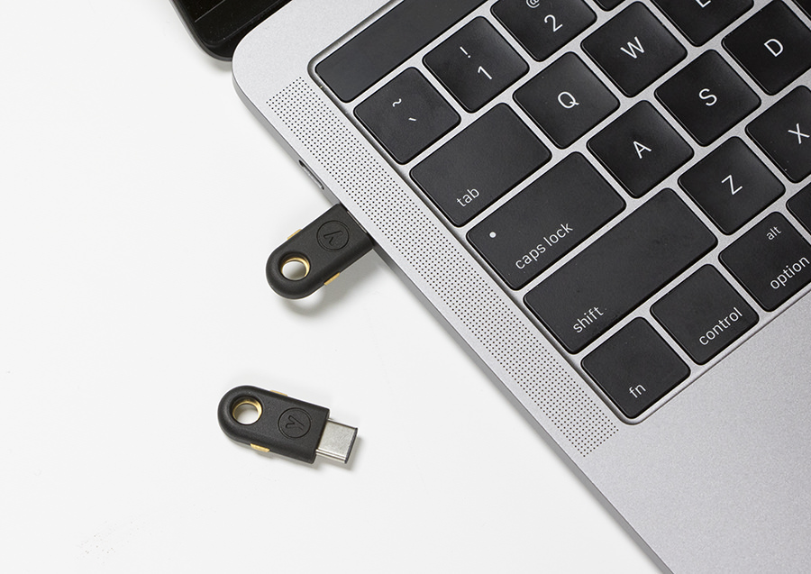

# Yubikey Handbook

_Featured on the [3rd-Party Labs (3PL) - YubiKey Innovations and Inspirations](https://forum.yubico.com/viewtopic.php?f=8&t=1942) compilation_.

Yubikey is an hardware device manufactured by Yubico that provides several forms of strong authentication and encryption. It has many use cases and interesting applications.

The _Yubikey Handbook_ is an attempt of exploring those use cases and is intended to be a living document. It is focused on the Yubikey 4/Yubikey 4 Nano. With some adaptations, parts of this document will also apply to the Yubikey NEO.

_Source: Yubico_

This book is [available online for free](https://ruimarinho.gitbooks.io/yubikey-handbook/content/) and is downloadable in [PDF](https://www.gitbook.com/download/pdf/book/ruimarinho/yubikey-handbook), [ePUB](https://www.gitbook.com/download/epub/book/ruimarinho/yubikey-handbook) or [Mobi/Kindle](https://www.gitbook.com/download/mobi/book/ruimarinho/yubikey-handbook) formats.

# License

 This work is licensed under a <a rel="license" href="http://creativecommons.org/licenses/by-nc-sa/4.0/">Creative Commons Attribution-NonCommercial-ShareAlike 4.0 International License</a>.

# About the author

Rui Marinho ([github](https://github.com/ruimarinho), [twitter](https://twitter.com/ruipmarinho), [npm](https://www.npmjs.com/~ruimarinho)) is a software engineer by day, a security engineer by night and a network engineer on weekends. This blend of interests has allowed him to plan and build large-scale infrastructure projects, having specialized in mission-critical and highly available systems with security as one of its top priorities. [Read more](introduction/about-the-author.md).
