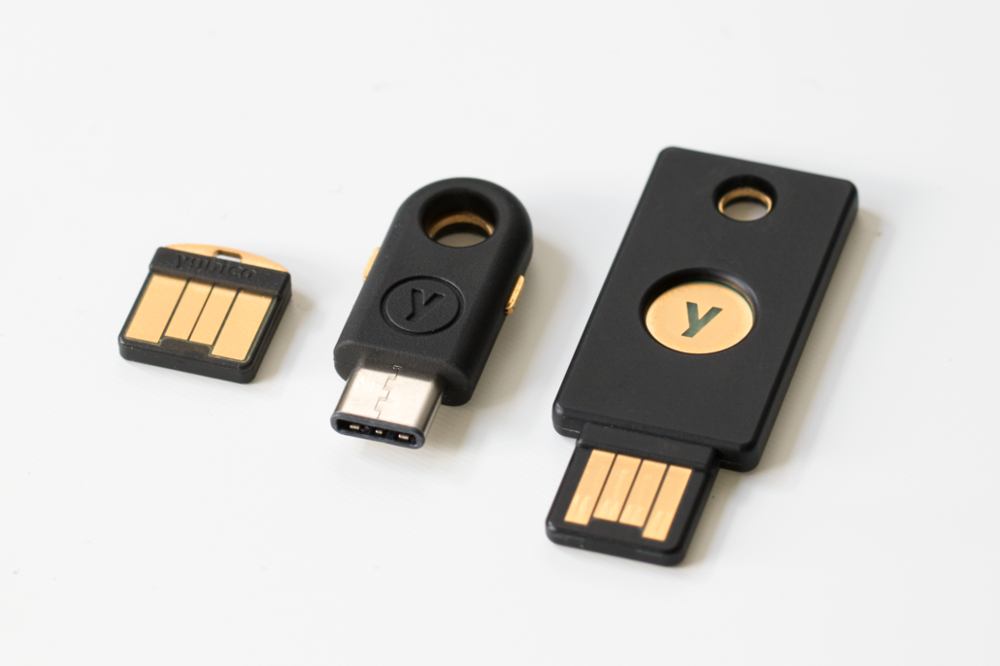

## Device initialization

_Source: Yubico_

Device initialization is straightforward but requires some organization around secret management. In the future, this can be improved by defining a group policy distributed via MDM which can enforce some of the settings mentioned below.

1. Enter a new PIN with 8 numeric characters if macOS login is intended. macOS won't work if the PIN contains alphanumeric characters. Generate and store this PIN securely on a password manager.
2. Set the _Management Key_ option to _Use a separate key_.
3. Under _Store management key_, randomize and store the resulting key on a password manager.
4. Enter a new PUK with 8 alphanumeric characters (A-Z, a-z, 0-9 and symbols are allowed), also generated on a password manager.
5. When asked if you want to _Set up Yubikey for macOS_ by generating certificates, choose _No_. This can be handled later on more selectively.
