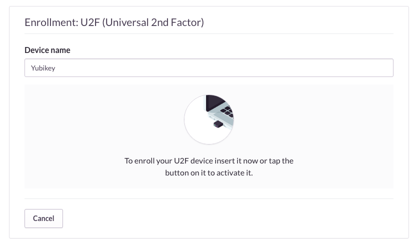

## U2F (Security Keys)

U2F is an open authentication standard based on public key cryptography created by the FIDO Alliance for accessing web-based services. Authentication is done on the client by creating a new key pair for each service and then providing its public key. During authentication, the client proves it is in the possession of the private key by signing a challenge sent by the provider.

No codes are manually typed or copied during this exchange, making U2F more convenient and also less susceptible to phishing and MITM attacks. Simply touch the Yubikey to approve signing the challenge.

Recent versions of Chrome and Opera come with U2F supported enabled by default. Support for Safari can be achieve using the [Safari-FIDO-U2F](https://github.com/blahgeek/Safari-FIDO-U2F) extension, although some user-agent emulation (`Develop > User Agent > Chrome for Mac`) is still required.

When registering the Yubikey as a Security Key, a good alias may be `Yubikey (<serial number in decimal format>)`.

[Some of the projects](http://www.dongleauth.info) that support U2F:

- Google
- GitHub
- Dropbox
- Sentry

_U2F device registration at [sentry.io](https://sentry.io)_

There is a great article _[Security Keys: Practical Cryptographic Second Factors for the Modern Web](http://fc16.ifca.ai/preproceedings/25_Lang.pdf)_ from Google detailing their experience deploying more than 50,000 Security Keys to their employees.
